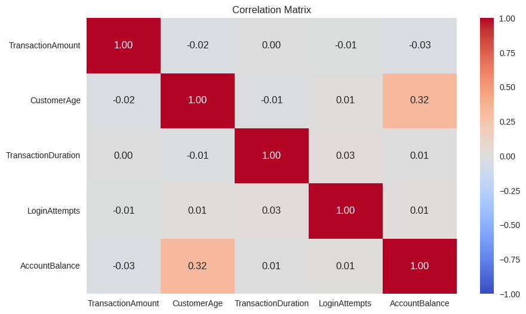
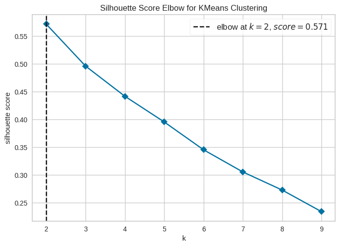
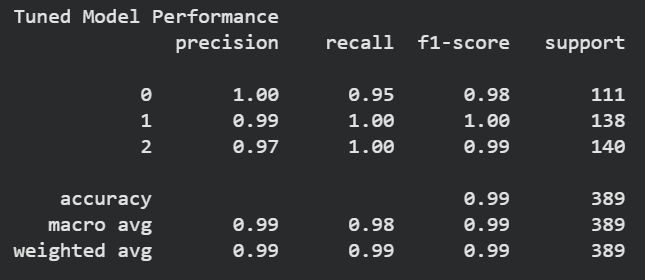

# 📊 Bank Transaction Clustering & Classification

## Project Overview

This project implements a complete Machine Learning workflow consisting of:

1. Customer Segmentation using K-Means Clustering
2. Cluster Prediction using Classification Models

The project was developed as part of the Dicoding BMLP final submission.

---

## Dataset

Dataset:

```text
bank_transactions_data_edited.csv
```

The dataset contains banking transaction information including:

- Transaction Amount
- Customer Age
- Transaction Duration
- Account Balance
- Transaction Type
- Customer Occupation
- Channel
- Location

---

## Exploratory Data Analysis

### Correlation Matrix



The correlation matrix is used to identify relationships between numerical features.

---

## Data Preprocessing

The following preprocessing steps were performed:

- Missing Value Handling
- Duplicate Removal
- Feature Encoding
- Outlier Removal
- Standard Scaling
- Feature Binning

---

## Clustering Stage

### Elbow Method



The Elbow Method was used to determine the optimal number of clusters.

### Clustering Visualization


Clusters were visualized using Principal Component Analysis (PCA).

### Clustering Evaluation

Metric used:

- Silhouette Score

Saved Models:

```text
model_clustering.h5
PCA_model_clustering.h5
```

---

## Cluster Interpretation


Each cluster was analyzed using:

- Mean
- Minimum
- Maximum
- Mode

to identify customer behavior patterns.

Generated datasets:

```text
data_clustering.csv
data_clustering_inverse.csv
```

---

## Classification Stage

### Algorithms

#### Decision Tree

```python
DecisionTreeClassifier()
```

Saved model:

```text
decision_tree_model.h5
```

#### Random Forest

```python
RandomForestClassifier()
```

Saved model:

```text
explore_RandomForest_classification.h5
```

---

## Hyperparameter Tuning

Hyperparameter tuning was performed using:

```python
GridSearchCV()
```

Parameters tuned:

- n_estimators
- max_depth
- min_samples_split

Saved model:

```text
tuning_classification.h5
```

---

## Model Evaluation

### Classification Report



Evaluation metrics:

- Accuracy
- Precision
- Recall
- F1-Score

---

## Project Structure

```text
.
├── notebooks
├── data
├── models
├── docs
├── assets
├── README.md
└── requirements.txt
```

---

## Technologies

- Python
- Pandas
- NumPy
- Matplotlib
- Seaborn
- Scikit-Learn
- Yellowbrick
- Joblib

---

## Author

Khalilul Afwan

Dicoding - Belajar Machine Learning untuk Pemula (BMLP)
